<div align="center">
  
</div>

# DosKit

A robust, cross-platform foundation for running DOS applications using js-dos WebAssembly technology. This project works seamlessly across different platforms (Windows, macOS, Linux) and devices (desktop, mobile, tablet).


## 🎯 Features

- **Interactive DOS Prompt**: Boots directly to a fully functional DOS command prompt
- **Cross-Platform**: Works on Windows, macOS, Linux, iOS, and Android
- **Progressive Web App (PWA)**: Install as a native app with offline support
- **Offline Functionality**: Works completely offline after first visit
- **Modern Tech Stack**: Built with React 19, TypeScript, and Vite
- **WebAssembly Performance**: Leverages js-dos v8.3.20 for near-native DOS emulation
- **Full Keyboard Support**: All standard DOS keyboard inputs including function keys and special characters
- **Audio Support**: Sound Blaster and AdLib emulation with proper audio output
- **Responsive Design**: Optimized for desktop, tablet, and mobile devices
- **Touch Controls**: Mobile-friendly on-screen keyboard for touch devices
- **Type-Safe**: Full TypeScript support with comprehensive type definitions
- **Service Worker Caching**: Fast loading with intelligent cache management

## 📋 Table of Contents

- [Quick Start](#quick-start)
- [Live Demo](#live-demo)
- [PWA Features](#pwa-features)
- [Technology Stack](#technology-stack)
- [Project Structure](#project-structure)
- [Development](#development)
- [Deployment](#deployment)
- [Configuration](#configuration)
- [Usage](#usage)
- [Browser Compatibility](#browser-compatibility)
- [Troubleshooting](#troubleshooting)
- [License](#license)

## 🚀 Quick Start

### Prerequisites

- Node.js 18+ (recommended: 24.4.1 or later)
- npm 9+ or yarn 1.22+

### Installation

1. Clone the repository:
```bash
git clone https://github.com/cameronrye/doskit.git
cd doskit
```

2. Install dependencies:
```bash
npm install
```

3. Start the development server:
```bash
npm run dev
```

4. Open your browser and navigate to `http://localhost:5173`

The DOS emulator will automatically load and present an interactive DOS prompt!

## 🌐 Live Demo

**Try it now**: [https://cameronrye.github.io/doskit/](https://cameronrye.github.io/doskit/)

The live demo is automatically deployed from the `main` branch using GitHub Actions. Every push to `main` triggers a new deployment.

## 📱 PWA Features

DosKit is a fully-featured **Progressive Web App** that can be installed on your device and works offline!

### ✨ Key PWA Features

- **📥 Installable**: Install DosKit as a native app on desktop and mobile
- **🔌 Offline Support**: Works completely offline after first visit
- **⚡ Fast Loading**: Service worker caches assets for instant loading
- **🎨 Native Experience**: Standalone mode without browser UI
- **🔄 Auto-Updates**: Automatic updates when new versions are available
- **📊 Connection Status**: Real-time online/offline indicator

### 🚀 Quick Install

**Desktop (Chrome/Edge/Brave):**
1. Visit the live demo
2. Click the install icon (⊕) in the address bar
3. Click "Install" to add to your desktop

**Mobile (Android):**
1. Visit the live demo in Chrome
2. Tap "Add to Home screen" from the menu
3. Launch from your home screen

**Mobile (iOS):**
1. Visit the live demo in Safari
2. Tap Share → "Add to Home Screen"
3. Launch from your home screen

### 📚 PWA Documentation

- **[PWA Quick Start Guide](docs/PWA-QUICK-START.md)** - Get started in 5 minutes
- **[Full PWA Documentation](docs/PWA.md)** - Comprehensive guide
- **[PWA Testing Guide](docs/PWA-TESTING.md)** - Testing checklist

## 🛠️ Technology Stack

### Core Technologies

- **[React 19.1.1](https://react.dev/)** - Modern UI framework with latest features
- **[TypeScript 5.9.3](https://www.typescriptlang.org/)** - Type-safe JavaScript
- **[Vite 7.1.14](https://vite.dev/)** - Next-generation frontend tooling (Rolldown variant)
- **[js-dos 8.3.20](https://js-dos.com/)** - WebAssembly DOS emulator

### Why These Technologies?

#### React + Vite (Rolldown Variant)
- **Fast Development**: Hot Module Replacement (HMR) for instant feedback
- **Modern Build**: Optimized production builds with code splitting
- **Developer Experience**: Excellent TypeScript integration and tooling
- **Experimental Rolldown**: This project uses the experimental Rolldown variant of Vite 7 for improved build performance. Rolldown is a Rust-based bundler that aims to replace Rollup in Vite. While experimental, it provides faster builds and better tree-shaking. For production use, you may want to switch to the stable Vite release by changing `vite` to the standard version in `package.json`.

#### js-dos v8.3.20
- **Latest Stable**: Most recent version with bug fixes and improvements
- **WebAssembly**: High-performance emulation (80-90% of native speed)
- **Cross-Platform**: Works in all modern browsers and Node.js
- **Multiple Backends**: Supports both DOSBox and DOSBox-X
- **Active Development**: Regular updates and community support

#### TypeScript
- **Type Safety**: Catch errors at compile time
- **Better IDE Support**: Autocomplete and inline documentation
- **Maintainability**: Easier to refactor and scale

## 📁 Project Structure

```
doskit/
├── docs/                      # Documentation
│   └── js-dos-llm-reference.md   # Comprehensive js-dos API reference
├── public/                    # Static assets (logos, favicons)
├── src/
│   ├── components/           # React components
│   │   ├── DosPlayer.tsx    # Main DOS emulator component
│   │   └── DosPlayer.css    # Component styles
│   ├── config/              # Configuration files
│   │   ├── dosbox.conf.ts   # DOSBox configurations
│   │   └── jsdos.config.ts  # js-dos settings
│   ├── dos-apps/            # DOS applications and games
│   ├── hooks/               # Custom React hooks
│   ├── types/               # TypeScript type definitions
│   │   └── js-dos.d.ts     # js-dos type definitions
│   ├── utils/               # Utility functions
│   ├── App.tsx              # Main application component
│   ├── App.css              # Application styles
│   ├── main.tsx             # Application entry point
│   └── index.css            # Global styles
├── .gitignore
├── eslint.config.js         # ESLint configuration
├── index.html               # HTML entry point
├── package.json             # Dependencies and scripts
├── tsconfig.json            # TypeScript configuration
├── vite.config.ts           # Vite configuration
└── README.md                # This file
```

## 💻 Development

### Available Scripts

```bash
# Start development server
npm run dev

# Build for production
npm run build

# Preview production build
npm run preview

# Run linter
npm run lint
```

### Development Workflow

1. **Start the dev server**: `npm run dev`
2. **Make changes**: Edit files in `src/`
3. **See changes instantly**: Vite HMR updates the browser automatically
4. **Test**: Interact with the DOS prompt to verify functionality
5. **Build**: Run `npm run build` to create production bundle

## 🚀 Deployment

DosKit is configured for automatic deployment to GitHub Pages. See the [Deployment Guide](docs/DEPLOYMENT.md) for detailed instructions.

### Quick Deployment

1. **Enable GitHub Pages** in repository settings (Settings → Pages → Source: GitHub Actions)
2. **Push to main branch**: `git push origin main`
3. **Monitor deployment**: Check the Actions tab
4. **Visit your site**: `https://cameronrye.github.io/doskit/`

The site automatically rebuilds and deploys on every push to `main`.

## ⚙️ Configuration

### DOSBox Configuration

DosKit uses DOSBox configuration files to customize the DOS environment. The default configuration is located in `src/config/dosbox.conf.ts`.

**Key Configuration Options:**

```typescript
import { defaultDosboxConfig } from './config/dosbox.conf';

// Use the default configuration
<DosPlayer dosboxConf={defaultDosboxConfig} />
```

**Custom Configuration Example:**

```typescript
const customConfig = `
[cpu]
core=auto
cycles=max

[autoexec]
@echo off
echo Welcome to My DOS App!
mount c .
c:
myapp.exe
`;

<DosPlayer dosboxConf={customConfig} />
```

### js-dos Options

Customize the emulator behavior with js-dos options in `src/config/jsdos.config.ts`:

```typescript
import { DosPlayer } from './components/DosPlayer';

<DosPlayer
  options={{
    theme: 'dark',
    volume: 0.7,
    fullScreen: false,
    autoStart: true,
  }}
/>
```

**Available Options:**
- `theme`: 'dark' or 'light'
- `volume`: 0.0 to 1.0
- `fullScreen`: Enable fullscreen mode
- `autoStart`: Auto-start emulator on load
- `backend`: 'dosbox' or 'dosboxX'
- `mouseCapture`: Auto-capture mouse input
- See `src/types/js-dos.d.ts` for complete options

### Mobile Configuration

DosKit automatically detects mobile devices and applies optimized settings:
- Larger touch controls
- On-screen keyboard with common DOS keys
- Optimized aspect ratio for mobile screens

## 📖 Usage

### Basic Usage

The simplest way to use DosKit is to run the development server:

```bash
npm run dev
```

This will start a DOS prompt that you can interact with directly in your browser.

### Adding DOS Applications

To run DOS applications or games:

1. **Create a custom DOSBox configuration:**

```typescript
const gameConfig = `
[autoexec]
@echo off
mount c .
c:
cd MYGAME
game.exe
`;
```

2. **Place your DOS files in the public directory** or use the `initFs` option to load files programmatically.

3. **Update the DosPlayer component:**

```typescript
<DosPlayer dosboxConf={gameConfig} />
```

### Programmatic Control

Access the Command Interface for programmatic control:

```typescript
import { useState } from 'react';
import { DosPlayer } from './components/DosPlayer';
import type { CommandInterface } from './types/js-dos';

function MyApp() {
  const [ci, setCi] = useState<CommandInterface | null>(null);

  const handleReady = (commandInterface: CommandInterface) => {
    setCi(commandInterface);

    // Now you can control DOS programmatically
    commandInterface.simulateKeyPress(13); // Press Enter
  };

  return <DosPlayer onReady={handleReady} />;
}
```

**Available Commands:**
- `ci.pause()` / `ci.resume()` - Control emulation
- `ci.mute()` / `ci.unmute()` - Audio control
- `ci.screenshot()` - Capture screen
- `ci.fsReadFile()` / `ci.fsWriteFile()` - File system access
- See `src/types/js-dos.d.ts` for complete API

## 🌐 Browser Compatibility

DosKit works on all modern browsers that support WebAssembly:

### Desktop Browsers
- ✅ **Chrome/Edge** 90+ (Recommended)
- ✅ **Firefox** 88+
- ✅ **Safari** 15+
- ✅ **Opera** 76+

### Mobile Browsers
- ✅ **Chrome Mobile** (Android)
- ✅ **Safari Mobile** (iOS 15+)
- ✅ **Firefox Mobile**
- ✅ **Samsung Internet**

### Requirements
- **WebAssembly** support (required)
- **JavaScript** enabled
- **Minimum 2GB RAM** recommended
- **Modern GPU** for WebGL rendering (optional but recommended)

### Known Limitations
- **iOS Safari < 15**: Limited WebAssembly support
- **Internet Explorer**: Not supported (no WebAssembly)
- **Older Android browsers**: May have performance issues

## 🔧 Troubleshooting

### Common Issues

#### "DOS emulator library not loaded"

**Problem**: js-dos failed to load from CDN.

**Solutions:**
1. Check your internet connection
2. Verify CDN is accessible: https://v8.js-dos.com/latest/js-dos.js
3. Check browser console for CORS or network errors
4. Try refreshing the page
5. Clear browser cache

#### Black Screen / Emulator Not Starting

**Problem**: Emulator loads but shows black screen.

**Solutions:**
1. Check browser console for errors
2. Verify WebAssembly is supported: `typeof WebAssembly !== 'undefined'`
3. Try a different browser
4. Disable browser extensions that might interfere
5. Check if hardware acceleration is enabled

#### Poor Performance / Lag

**Problem**: Emulator runs slowly.

**Solutions:**
1. Reduce CPU cycles in DOSBox config: `cycles=10000`
2. Enable hardware acceleration in browser settings
3. Close other browser tabs
4. Try a different rendering backend: `renderBackend: 'canvas'`
5. Reduce screen resolution if possible

#### Keyboard Not Working

**Problem**: Keyboard input not registering.

**Solutions:**
1. Click inside the emulator window to focus it
2. Check if browser has focus (not in another tab)
3. Try clicking the "Play" button if visible
4. On mobile, use the on-screen keyboard
5. Check browser console for errors

#### Audio Not Playing

**Problem**: No sound from DOS applications.

**Solutions:**
1. Check browser audio is not muted
2. Verify volume setting: `volume: 0.7` in options
3. Click inside emulator (browsers require user interaction for audio)
4. Check if DOS application has sound enabled
5. Try `ci.unmute()` programmatically

#### Mobile Touch Controls Not Appearing

**Problem**: On-screen keyboard missing on mobile.

**Solutions:**
1. Verify you're on a mobile device (check user agent)
2. Check mobile configuration is applied
3. Try portrait and landscape orientations
4. Refresh the page
5. Check `softKeyboardLayout` in config

### Debug Mode

Enable detailed logging in development:

```typescript
// Logs are automatically enabled in development mode
// Check browser console for detailed information
```

### Getting Help

If you encounter issues not covered here:

1. **Check the browser console** for error messages
2. **Review js-dos documentation**: https://js-dos.com
3. **Open an issue**: https://github.com/cameronrye/doskit/issues
4. **Include**:
   - Browser and version
   - Operating system
   - Error messages from console
   - Steps to reproduce

## 📄 License

This project is licensed under the **MIT License** - see the [LICENSE](LICENSE) file for details.

### Third-Party Licenses

- **js-dos**: GPL-2.0 License - https://github.com/caiiiycuk/js-dos
- **React**: MIT License
- **DOSBox**: GPL-2.0 License

## 🤝 Contributing

Contributions are welcome! Please see [CONTRIBUTING.md](CONTRIBUTING.md) for guidelines.

## 🙏 Acknowledgments

- **js-dos** by caiiiycuk - For the amazing WebAssembly DOS emulator
- **DOSBox** team - For the original DOS emulation
- **React** team - For the excellent UI framework

## 📞 Contact

- **Author**: Cameron Rye
- **Website**: https://rye.dev
- **GitHub**: https://github.com/cameronrye/doskit

---

Made with ❤️ by [Cameron Rye](https://rye.dev)
