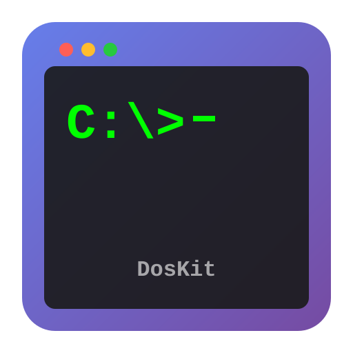

<div align="center">
  
</div>

# DosKit

A robust, cross-platform foundation for running DOS applications using js-dos WebAssembly technology. This project works seamlessly across different platforms (Windows, macOS, Linux) and devices (desktop, mobile, tablet).


## Features

- **Interactive DOS Prompt**: Boots directly to a fully functional DOS command prompt
- **App Library**: Classic demos such as Second Reality, Unreal and Crystal Dream 2, and the Impulse Tracker and Scream Tracker 3 music trackers, picked from a floppy-disk selector
- **Cross-Platform**: Works on Windows, macOS, Linux, iOS, and Android
- **Progressive Web App (PWA)**: Install as a native app with offline support
- **Deep Linking**: Load specific applications directly via URL (e.g., `?app=secondreality`)
- **Offline Functionality**: After the first visit, the DOS prompt works offline, and so does every app opened online after that
- **Modern Tech Stack**: Built with React 19, TypeScript, and Vite
- **WebAssembly Performance**: Leverages js-dos for near-native DOS emulation
- **Full Keyboard Support**: All standard DOS keyboard inputs including function keys and special characters, but for the shortcuts browsers keep for themselves (see [Known Limitations](#known-limitations))
- **Audio Support**: Sound Blaster, Gravis UltraSound and AdLib emulation with proper audio output
- **Responsive Design**: Optimized for desktop, tablet, and mobile devices
- **Fullscreen**: The fullscreen button in the js-dos sidebar makes the player fill the browser window, over DosKit's header and footer. js-dos then narrows its sidebar to a strip on the left: click the strip to bring back the button, which leaves fullscreen
- **Touch Controls**: On-screen keyboard in the js-dos sidebar. Phones and tablets get DosKit's compact layout first, with js-dos's full keyboard and function-key layout behind its ⎘ key (see [Mobile Configuration](#mobile-configuration))
- **Type-Safe**: Full TypeScript support with comprehensive type definitions
- **Service Worker Caching**: Fast loading with intelligent cache management

## Table of Contents

- [Quick Start](#quick-start)
- [Live Demo](#live-demo)
- [PWA Features](#pwa-features)
- [Technology Stack](#technology-stack)
- [Project Structure](#project-structure)
- [Development](#development)
- [Deployment](#deployment)
- [Configuration](#configuration)
- [Usage](#usage)
- [Browser Compatibility](#browser-compatibility)
- [Troubleshooting](#troubleshooting)
- [License](#license)

## Quick Start

### Prerequisites

- Node.js 24+ (see `.nvmrc`)
- npm, which comes with Node.js (dependencies are locked in `package-lock.json`)

### Installation

1. Clone the repository:

```bash
git clone https://github.com/cameronrye/doskit.git
cd doskit
```

2. Install dependencies:

```bash
npm install
```

3. Start the development server:

```bash
npm run dev
```

4. Open your browser and navigate to `http://localhost:5173`

The DOS emulator will automatically load and present an interactive DOS prompt, with the app selector open over it!

## Live Demo

**Try it now**: [https://doskit.net/](https://doskit.net/)

The live demo is automatically deployed from the `main` branch using GitHub Actions. Every push to `main` runs the CI checks and deploys once they pass.

## PWA Features

DosKit is a fully-featured **Progressive Web App** that can be installed on your device and works offline!

### Key PWA Features

- **Installable**: Install DosKit as a native app on desktop and mobile
- **Offline Support**: After the first visit, the DOS prompt works offline, and so does every app opened online after that
- **Fast Loading**: Service worker caches assets for instant loading
- **Native Experience**: Standalone mode without browser UI
- **Update Prompt**: New versions install in the background, and an "Update Available" prompt switches to them when you choose **Update Now**. DosKit checks for one every hour and whenever you return to the tab. The prompt gives the keyboard focus to **Later**, which Escape answers too, so a key meant for a DOS program cannot reload the page; keys pressed in the prompt never reach DOS. Once one tab has updated, the other open tabs say that DosKit was updated in another tab and offer **Reload**, even those that had put the update off
- **Connection Status**: Real-time online/offline indicator

### Quick Install

**Desktop (Chrome/Edge/Brave):**

1. Visit the live demo
2. Click the install icon (⊕) in the address bar
3. Click "Install" to add to your desktop

**Desktop (Firefox on Windows):**

1. Visit the live demo
2. Click the web apps icon in the address bar
3. DosKit is added to the taskbar, and opens in a window of its own

**Mobile (Android):**

1. Visit the live demo in Chrome
2. Tap "Add to Home screen" from the menu
3. Launch from your home screen

**Mobile (iOS):**

1. Visit the live demo in Safari
2. Tap Share → "Add to Home Screen"
3. Launch from your home screen

In Chrome, Edge and other Chromium browsers, DosKit also shows its own **Install DosKit** prompt five seconds after the browser reports that the app can be installed. **Not now** hides it for a week, and after the third time it stops asking. In windows under 450px tall, such as a phone held sideways, the prompt keeps to one row: its title and its two buttons.

### How Offline Works

The service worker (`public/sw.js`) is registered by production builds only, so `npm run dev` runs without it. To try it locally, run `npm run build` and then `npm run preview`.

- **On install**, the worker stores the app shell (`index.html`, the manifest, the logo and favicon, and every JS and CSS bundle, including the chunks loaded on demand) and, in a cache of their own, js-dos's player (`js-dos.js`, `js-dos.css`) and the emulator files of its default DOSBox backend. It serves js-dos's files from there and never refreshes them, so a page gets the player and the emulator files of the js-dos version its worker installed. A page still open when a worker with another js-dos version takes over, such as after **Update Now** in another tab, can mix them: until it reloads, its next player can get that version's emulator files.
- **App archives** (`/demos/<id>.zip`) are stored the first time each app is opened while the service worker runs. On a first visit, an app opened before the worker has started, such as a deep link's, is stored the next time it is opened. An app not stored yet cannot start offline: while the browser reports being offline, it fails at once with "This application isn't available offline yet", and opening it once online stores it.
- **While offline**, a banner at the top says so, and screen readers announce it: the applications you have opened while online still work, and the others need a connection to load. It appears when the connection drops while DosKit is open and on a page opened offline, moves the header down below it, can be closed, and goes away when the connection returns, with a **Back online** notice at the top for 3 seconds. In windows under 500px tall it keeps to one line.
- **Pages** come from the network. When the network fails or takes more than 5 seconds, every URL gets the `index.html` stored on install, so a URL never visited online, such as a new deep link, opens too. Pages are not stored as they are visited.
- **Deploys**: the app shell cache is named after a hash of what the build made, every file the site serves and the worker, so a deploy that changes any of them installs a new worker with a cache of its own, which replaces the previous one when the new version takes over, and a deploy that changes none of them, such as one that only changes `README.md`, installs nothing and offers no update. Bundles are named after their content, and install copies those the previous version's cache holds under the same name, so of the bundles a new version downloads only those it changed. js-dos's player and emulator files stay cached until the js-dos version changes, and an update waiting to take over cannot change them under an open page. Pages come from the network, though, so until the new version takes over, a page loaded under the previous one gets the new `index.html` and bundles with the previous js-dos: after a deploy that upgrades js-dos, such a page runs the new app on the old js-dos. App archives stay cached until an archive is added, changed or removed; the version that does so drops them all as it takes over, and each is downloaded again the next time it is opened.

DOSBox-X is not precached: DosKit starts js-dos without its backend picker, so every app runs on the default backend.

## Technology Stack

### Core Technologies

- **[React 19](https://react.dev/)** - Modern UI framework with latest features
- **[TypeScript](https://www.typescriptlang.org/)** - Type-safe JavaScript
- **[Vite 8](https://vite.dev/)** - Next-generation frontend tooling, bundling with Rolldown
- **[js-dos 8](https://js-dos.com/)** - WebAssembly DOS emulator
- **[Vitest](https://vitest.dev/)** - Test runner, with jsdom and Testing Library

`package.json` pins their exact versions.

### Why These Technologies?

#### React + Vite

- **Fast Development**: Hot Module Replacement (HMR) for instant feedback
- **Modern Build**: Optimized production builds with code splitting: React gets a chunk of its own, and each app's configuration is a separate chunk that the page imports only when it needs it
- **Developer Experience**: Excellent TypeScript integration and tooling
- **Rolldown**: Vite 8 bundles with Rolldown, a Rust-based bundler that took over from Rollup in Vite. `vite.config.ts` configures it through `build.rolldownOptions`.

#### js-dos

- **Self-Hosted**: `package.json` pins an exact js-dos version, and `scripts/copy-js-dos.js` copies it from `node_modules` into `public/` before every dev server start and build, so DosKit never loads js-dos from a CDN
- **WebAssembly**: High-performance emulation, with DOSBox running in a Web Worker
- **Cross-Platform**: Works in all modern browsers and Node.js
- **Multiple Backends**: Supports both DOSBox and DOSBox-X; DosKit runs every app on DOSBox
- **Active Development**: Regular updates and community support

#### TypeScript

- **Type Safety**: Catch errors at compile time
- **Better IDE Support**: Autocomplete and inline documentation
- **Maintainability**: Easier to refactor and scale

## Project Structure

```
doskit/
├── .github/workflows/             # CI, GitHub Pages deployment, release-please
├── docs/                          # Documentation
│   ├── ARCHITECTURE.md            # How DosKit is put together
│   ├── *.md                       # Error handling, performance, SEO, style guide, sceners
│   └── js-dos-llm-reference.md    # Comprehensive js-dos API reference
├── public/                        # Static files, copied into the build as they are
│   ├── demos/                     # The apps' ZIP archives (sources and terms in its README)
│   ├── icons/                     # PWA icons
│   ├── licenses/                  # Licenses of js-dos, DOSBox, DOSBox-X and libzip, with their sources
│   ├── manifest.json              # PWA manifest
│   ├── sw.js                      # Service worker
│   ├── llms.txt                   # Summary and links for language models (llmstxt.org)
│   ├── llms-full.txt              # The full documentation, in one file, for language models
│   ├── emulators/                 # js-dos emulator files (generated)
│   ├── js-dos.js                  # js-dos player (generated)
│   └── js-dos.css                 # js-dos styles (generated)
├── scripts/
│   ├── copy-js-dos.js             # Copies js-dos into public/ before dev and build
│   ├── inject-sw-version.js       # Writes cache names and the precache list into dist/sw.js
│   ├── check-built-css.js         # CI's check that the built CSS works in the oldest supported browsers
│   ├── help.js                    # npm run help
│   ├── generate-icons.js          # PWA icons from logo.svg
│   ├── generate-social-images.js  # Social preview PNGs from their SVGs
│   └── *.test.js                  # Tests of the first three scripts, the service worker, 404.html, robots.txt,
│                                  # the licenses page, the icons, index.html's metadata and the ESLint config
├── src/
│   ├── adapters/                  # Emulator adapter around js-dos's window.Dos()
│   ├── components/                # React components
│   │   ├── DemoSelector.tsx       # App selector
│   │   ├── DosPlayer.tsx          # Runs one js-dos player
│   │   ├── DosPlayerUI.tsx        # The player's loading and error states
│   │   ├── DosPlayerWithApps.tsx  # Loads apps and switches between them
│   │   ├── ErrorBoundary.tsx
│   │   ├── OfflineIndicator.tsx   # Offline notice and install prompt
│   │   ├── UpdateNotification.tsx # "Update Available" prompt
│   │   └── *.css                  # Component styles
│   ├── config/                    # Configuration files
│   │   ├── apps.config.ts         # The apps in the selector
│   │   ├── apps.config.test.ts    # Checks every app's archive, its entry in public/demos/README.md
│   │   │                          # and its DOSBox configuration
│   │   ├── dosbox.conf.ts         # DOSBox configuration of the DOS prompt
│   │   └── jsdos.config.ts        # js-dos settings (desktop and mobile)
│   ├── constants/                 # PWA and UI constants
│   ├── dos-apps/                  # Each app's archive URL and DOSBox configuration
│   ├── hooks/
│   │   └── useDosEmulator.ts      # Starts and stops js-dos
│   ├── integration/               # Integration tests
│   ├── test/                      # Test setup, and the stylesheets the style tests read
│   ├── types/                     # TypeScript type definitions
│   │   ├── dos-app.ts             # DosApp
│   │   ├── js-dos.d.ts            # js-dos type definitions
│   │   └── js-dos.test.ts         # Compile-time checks of those types (tsc -b)
│   ├── utils/                     # Utility functions
│   │   ├── diskLoader.ts          # Downloads app archives
│   │   ├── dosboxConfigBuilder.ts # Builds DOSBox configurations
│   │   ├── errorMessages.ts       # User-friendly error messages
│   │   ├── errorTracking.ts       # Error tracking (logs to the console)
│   │   ├── fetchWithRetry.ts      # Retries failed requests with backoff
│   │   ├── globalErrorHandler.ts  # Uncaught errors and unhandled rejections
│   │   ├── keysAroundDos.ts       # Keeps the keys pressed on DosKit's controls from js-dos
│   │   ├── logger.ts              # Logger
│   │   ├── serviceWorkerRegistration.ts
│   │   ├── storage.ts             # localStorage that never throws
│   │   ├── updatePrompt.ts        # Shows the "Update Available" prompt
│   │   └── urlRouting.ts          # Deep links
│   ├── App.tsx                    # Main application component
│   ├── App.css                    # Application styles
│   ├── main.tsx                   # Application entry point
│   ├── main.test.tsx              # Checks main.tsx's update prompt and error handler
│   ├── index.css                  # Global styles
│   └── vite-env.d.ts              # Types of the build-time constants
├── .gitignore
├── eslint.config.js               # ESLint configuration
├── index.html                     # HTML entry point
├── package.json                   # Dependencies and scripts
├── tsconfig.json                  # TypeScript configuration (app, Node and test projects)
├── tsconfig.test.json             # Type-checks the tests
├── typedoc.json                   # API documentation (npm run docs)
├── vite.config.ts                 # Vite configuration
├── vitest.config.ts               # Vitest configuration
└── README.md                      # This file
```

Tests sit next to the code they test, as `*.test.ts` and `*.test.tsx` files. The generated files in `public/` are copied from `node_modules` by `scripts/copy-js-dos.js` and are not committed.

## Development

### Available Scripts

```bash
# List all scripts by category, with the command each one runs
npm run help

# Start development server
npm run dev

# Build for production
npm run build

# Preview production build (http://localhost:4173)
npm run preview

# Run linter
npm run lint

# Format all files with Prettier
npm run format

# Check formatting, as CI does
npm run format:check

# Run tests once
npm test

# Run tests in watch mode
npm run test:watch

# Run tests with UI
npm run test:ui

# Run tests with coverage
npm run test:coverage

# Generate API documentation into docs/api/
npm run docs

# Regenerate the PWA icons and the social preview images
npm run generate-icons
npm run generate-social-images
```

> **Tip**: Run `npm run help` anytime to see a formatted list of all available commands!

`npm run dev` and `npm run build` first run `scripts/copy-js-dos.js`, which copies the js-dos runtime from `node_modules` into `public/` (`js-dos.js`, `js-dos.css` and `emulators/`). If you start Vite another way, such as `npx vite`, run `node scripts/copy-js-dos.js` first, and again after updating js-dos.

`npm run build` type-checks the app, the tests and the Vite and Vitest configs (`tsc -b`), builds into `dist/`, and runs `scripts/inject-sw-version.js`, which writes the cache names and the list of files to precache into `dist/sw.js`. The build fails if a file it would precache is missing from `dist/`.

### Development Workflow

1. **Start the dev server**: `npm run dev`
2. **Make changes**: Edit files in `src/`
3. **See changes instantly**: Vite HMR updates the browser automatically
4. **Test**: Run `npm test`, and interact with the DOS prompt to verify functionality
5. **Build**: Run `npm run build` to create production bundle

Commits go through a pre-commit hook that runs ESLint, Prettier and the related tests on staged JavaScript and TypeScript files, and Prettier on the other staged files; see [CONTRIBUTING.md](CONTRIBUTING.md#making-changes) for the details.

## Deployment

DosKit is configured for automatic deployment to GitHub Pages.

### Quick Deployment

1. **Enable GitHub Pages** in repository settings (Settings → Pages → Source: GitHub Actions)
2. **Push to main branch**: `git push origin main`
3. **Monitor deployment**: Check the Actions tab
4. **Visit your site**: `https://doskit.net/` for this repository

Every push to `main` starts the Deploy to GitHub Pages workflow (`.github/workflows/deploy.yml`), which can also be run by hand from the Actions tab. It runs the CI jobs from `ci.yml` (ESLint and the format check, the tests with coverage, the build and a check that its CSS works in the oldest supported browsers, the type check, and `npm audit`, which fails on a high or critical advisory in a production dependency and only reports on the rest) and a production build of its own, and deploys that build only if both succeed. Pull requests to `main` run the same CI jobs.

The build also writes `dist/404.html`, a copy of `index.html`. GitHub Pages serves it for any path it has no file for, so path-style links such as `https://doskit.net/secondreality` start the app, which rewrites them to `/?app=secondreality`. They come with a 404 status, though, as every path GitHub Pages has no file for does, while `/?app=` links come with a 200.

DosKit has to be served from the root of its domain: `vite.config.ts` sets `base: '/'`, and the bundles, the service worker, js-dos and the app archives are all requested by absolute paths. A fork needs a custom domain or a `<user>.github.io` repository; it does not work under a project path such as `https://<user>.github.io/doskit/`.

### Creating Releases

DosKit uses **fully automated releases** with [release-please](https://github.com/googleapis/release-please):

1. **Use conventional commits**: `feat:`, `fix:`, etc.
2. **Merge PR to main**: That's it!
3. **release-please bot**: Automatically creates a Release PR
4. **Merge Release PR**: Automatic GitHub release, with a ZIP of the built site attached

See [CONTRIBUTING.md](CONTRIBUTING.md#commit-messages) for details on conventional commits.

## Configuration

### DOSBox Configuration

DosKit uses DOSBox configuration files to customize the DOS environment. The default configuration, which the DOS prompt runs with, is located in `src/config/dosbox.conf.ts`; each app has its own in `src/dos-apps/`.

**Key Configuration Options:**

```typescript
import { defaultDosboxConfig } from './config/dosbox.conf';

// Use the default configuration (also what DosPlayer uses without a dosboxConf)
<DosPlayer dosboxConf={defaultDosboxConfig} />
```

**Custom Configuration Example:**

```typescript
const customConfig = `
[cpu]
core=auto
cycles=max

[autoexec]
@echo off
echo Welcome to My DOS App!
mount c .
c:
myapp.exe
`;

<DosPlayer dosboxConf={customConfig} />
```

`mount c .` mounts the files js-dos starts with, which you pass in its `initFs` option, as drive C: see [Adding DOS Applications](#adding-dos-applications).

Every app runs on js-dos's default `dosbox` backend, which drops settings it does not have, and resets values it does not accept, without a warning. It has no dynamic core, no `486`, `pentium` or `pentium_mmx` CPU type, no `[dos] ver` setting (DOS reports version 5.00) and no `[memory]` section: memory is `memsize` in `[dosbox]`, up to 63 MB, and every app runs with DOSBox's default 16 MB unless its config sets another. Panic and the Squid intro run on `machine=vgaonly`, which draws their palette effects line by line as a real VGA does. [src/dos-apps/README.md](src/dos-apps/README.md) covers what it accepts, and `src/utils/dosboxConfigBuilder.ts` builds configurations from those settings only.

### js-dos Options

DosKit's js-dos settings are in `src/config/jsdos.config.ts`. For five of them, and for the on-screen controls' scale, which DosKit leaves at js-dos's default, the choices made in js-dos's settings panel win: js-dos saves the volume, the mouse sensitivity, the aspect ratio, the image rendering, the theme and the on-screen controls' scale in `localStorage`, and DosKit passes the saved choices to every new player in place of its own or js-dos's, so they last through app switches and reloads. (A change to Mirror controls, which `Dos()` has no option for, applies to the running player, but each player started after it goes back to the value the page loaded with until the next reload.) js-dos also saves the values a start gives it, so once DosKit has run in a browser, a change to its defaults for those five no longer reaches that browser. A DosPlayer's `options` are merged over both:

```typescript
import { DosPlayer } from './components/DosPlayer';

<DosPlayer
  options={{
    theme: 'dark',
    volume: 0.7,
    autoStart: true,
  }}
/>
```

**Available Options:**

- `theme`: A js-dos theme, such as 'dark' (DosKit's default) or 'light'
- `volume`: 0.0 to 1.0
- `fullScreen`: Start in the browser's fullscreen. js-dos applies it before `softFullscreen`, through the browser's Fullscreen API, which browsers only allow just after a click or key press. DosKit leaves it unset: set to `false`, it has js-dos call `document.exitFullscreen()` at every start, which rejects outside fullscreen and leaves the rejection unhandled
- `softFullscreen`: Have the fullscreen button in the js-dos sidebar make the player fill the browser window, instead of asking the browser's Fullscreen API; DosKit sets it
- `autoStart`: Auto-start emulator on load
- `backend`: 'dosbox' or 'dosboxX'. DosKit's DOSBox configurations are written for 'dosbox', and only that backend is precached for offline use
- `mouseCapture`: Auto-capture mouse input
- `initFs`: The files to start with: a ZIP archive as a `Uint8Array`, one `{ path, contents }` file, or a list of archives and files. js-dos writes the files first, then unpacks the archives in list order, so an archive's files replace those of the archives before it and any listed file at the same path
- See `src/types/js-dos.d.ts` for the options DosKit declares; it leaves out js-dos's IPX networking options (`ipx`, `ipxBackend`, `room` and `noNetworking`)

DosPlayer sets `dosboxConf` (from its prop of that name) and `onEvent` itself, so those two have no effect in `options`.

### Mobile Configuration

DosKit detects phones and tablets by their user agent and applies `mobileJsDosConfig` from `src/config/jsdos.config.ts`. It gives the on-screen keyboard, which the keyboard button in the js-dos sidebar opens, three layouts. The ⎘ key on each switches to the next, and from the last back to the first:

1. **DosKit's compact layout**, shown first: Esc, F1, F2, F3 and F5; 1 to 5 and Backspace; the left-hand letters q w e r t, a s d f g and z x c v b; ⎘, Ctrl, Alt, Space and Enter; and the arrow keys
2. **js-dos's full keyboard**: every letter and digit, Esc, Tab, Shift, Ctrl, Alt, Space, Backspace, Enter, the arrow keys and `` ` - = ( ) { } [ ] \ ; : ' , . / ``
3. **js-dos's function-key layout**: F1 to F12, Esc, 0 to 9, `{ } ( )`, Shift, Ctrl, Alt, Space, PgUp, PgDown, Backspace, Del, Tab, the arrow keys, a keypad whose digits but 5 and 0 are labeled as arrows, and `-`, `+`, `.` and Enter

All three label their keys as js-dos does, such as ␛ for Esc, ⌫ for Backspace, ↵ for Enter and ⇑ for Shift. js-dos presses nothing for the `\` and `/` keys of its own full keyboard, and keypad 0 for its `` ` `` key, so DosKit's copy names those three keys `Ü`, `¿` and `À`, which js-dos presses as `\`, `/` and `` ` ``, and labels them `\`, `/` and `` ` ``. It leaves out js-dos's En/Ru key, which switches the labels to Russian.

Safari on iPadOS identifies itself as a Mac by default, so an iPad in Safari gets the desktop settings and js-dos's own two layouts, the function-key layout first.

## Usage

### Basic Usage

The simplest way to use DosKit is to run the development server:

```bash
npm run dev
```

This will start a DOS prompt that you can interact with directly in your browser.

On the start page, the app selector opens over the prompt. Click an app to see its details and **Load Application** below the disks, or double-click it to load it at once. Picking the app that is running starts it again, such as a demo that has ended at the DOS prompt. The header's **Change Application** (or **Select Application**) button opens the selector again.

With the keyboard, the list of apps is a single Tab stop: the arrow keys, Home and End move between the apps and select them, Space selects the app with the focus, and Enter loads it. Tab and Shift+Tab go round the selector's controls without leaving it. While an app downloads, the arrow keys only move the focus: Space or a click on another app cancels the download and selects that app, and Enter or a double-click on it loads it instead. Escape cancels a download, or else closes the selector. Closed from the keyboard, the selector gives the focus back to what had it when it opened, such as the header's button; after a pick, a close with the mouse, or a close of the selector the start page opened with, the focus is on the page. Closed over the **Error Loading Application** box, from the keyboard or with the mouse, it gives the focus to the box's **Try Again** instead.

Keys pressed on DosKit's own controls, such as the selector, the header's button, the notices and the footer's links, stay with them and never reach the running program. While the page itself has the focus, as after a pick or a click on the DOS screen, DOS gets every key, Tab included, so the keyboard alone cannot get back to DosKit's controls: click one of them (see [Known Limitations](#known-limitations)).

The footer shows whether DOS is **Loading**, **Ready** or stopped by an **Error** (an app that failed to load, an emulator that could not start, or an error that took the player down), and whether the browser is **Online** or **Offline**. It also links to the [licenses](#third-party-licenses) of the software the site serves.

### Deep Linking

DosKit supports loading specific applications directly via URL parameters, making it easy to share links to specific DOS applications. An app's link is `/?app=` and its id from `src/config/apps.config.ts` without hyphens:

**Load Second Reality:**

```
https://doskit.net/?app=secondreality
```

**Load Impulse Tracker:**

```
https://doskit.net/?app=impulsetracker
```

**Features:**

- **Shareable Links**: URLs automatically update when you select an app
- **Bookmarkable**: Save direct links to your favorite DOS applications
- **Other Forms**: Path-style links such as `https://doskit.net/secondreality`, the id with its hyphens (`?app=second-reality`) and any capitalization work too, and the address bar shows them as `/?app=secondreality`
- **Browser Navigation**: Back and Forward load the app in the URL. The running app stops, sound and all, as soon as the next one starts downloading, and "Loading application..." shows while it downloads, with a **Cancel** button that stops the download and returns to the DOS prompt, with the selector open. Going back to the start URL stops the running app and returns to the DOS prompt, with the selector open
- **Refresh-Safe**: Page refreshes maintain the loaded application
- **Error Handling**: An `?app=` value that names no app, an empty one included, opens the start page, whose selector says "Application not found" above the disks until it closes or an app loads, and the value is removed from the address bar without a new history entry. A value with nothing safe to show, such as one with no letters, digits, hyphens or underscores, or one with more than 100 of them, gets the message without it. An `?app=` parameter decides even when the path names an app; a path that names no app opens the start page

### Adding DOS Applications

To add an app to DosKit's selector, with a link of its own, follow [src/dos-apps/README.md](src/dos-apps/README.md): a ZIP archive in `public/demos/`, a config module in `src/dos-apps/`, and an entry in `src/config/apps.config.ts`.

To run a DOS program of your own with the `DosPlayer` component directly:

1. **Create a custom DOSBox configuration:**

```typescript
const programConfig = `
[autoexec]
@echo off
mount c .
c:
cd MYPROG
myprog.exe
`;
```

2. **Package your DOS files in a ZIP archive** in the public directory, for example as `public/myprog.zip`. Keep it out of `public/demos/`: `src/config/apps.config.test.ts` fails for an archive there that no app in the selector loads. js-dos only sees the files passed in its `initFs` option.

3. **Download the archive and hand it to DosPlayer:**

```typescript
import { useEffect, useState } from 'react';
import { DosPlayer } from './components/DosPlayer';
import { loadZipArchive } from './utils/diskLoader';

function MyProgram() {
  const [zip, setZip] = useState<Uint8Array | null>(null);

  useEffect(() => {
    const controller = new AbortController();
    loadZipArchive('/myprog.zip', undefined, controller.signal).then(setZip, () => {
      // Aborted on unmount, or failed: loadZipArchive logs failures
    });
    return () => controller.abort();
  }, []);

  // DosPlayer starts js-dos when it mounts, so mount it once the files are here
  if (!zip) return <p>Loading...</p>;
  return <DosPlayer dosboxConf={programConfig} options={{ initFs: zip }} />;
}
```

DosPlayer's props are `dosboxConf` (the DOS prompt's configuration if left out), `options`, `onReady(ci)`, `onExit()`, `onError(error)`, `className` and `style`. It reads `dosboxConf` and `options` only when it mounts: to run something else, remount it with a new `key`, as `DosPlayerWithApps` does for each start, so that picking the app that is running starts it again. `onError` is called, while the player is mounted, with the message it shows when the emulator cannot start.

### Programmatic Control

Access the Command Interface for programmatic control:

```typescript
import { useState } from 'react';
import { DosPlayer } from './components/DosPlayer';
import type { CommandInterface } from './types/js-dos';

function MyApp() {
  const [ci, setCi] = useState<CommandInterface | null>(null);

  const handleReady = (commandInterface: CommandInterface) => {
    setCi(commandInterface);

    // Now you can control DOS programmatically
    commandInterface.simulateKeyPress(257); // Press Enter (257 in js-dos key codes)
  };

  return (
    <>
      <DosPlayer onReady={handleReady} onExit={() => setCi(null)} />
      <button onClick={() => ci?.pause()} disabled={!ci}>
        Pause
      </button>
    </>
  );
}
```

`onExit` is called once for each `onReady`: when DOS exits, or when the player is unmounted.

**Available Commands:**

- `ci.pause()` / `ci.resume()` - Control emulation
- `ci.mute()` / `ci.unmute()` - Audio control
- `ci.screenshot()` - Capture screen
- `ci.fsReadFile()` / `ci.fsWriteFile()` - File system access
- `ci.simulateKeyPress()` / `ci.sendKeyEvent()` - Keyboard input, in js-dos key codes rather than the browser's: Enter is 257 and Esc 256, while letters (uppercase) and digits keep their ASCII codes
- See `src/types/js-dos.d.ts` for the whole command interface, as js-dos's emulators package declares it

## Browser Compatibility

DosKit works on all modern browsers that support WebAssembly:

### Desktop Browsers

- **Chrome/Edge** 98+ (Recommended)
- **Firefox** 94+
- **Safari** 15.4+
- **Opera** 84+

### Mobile Browsers

- **Safari** on iOS and iPadOS 15.4+
- **Chrome** and **Firefox** on Android, from the same versions as on the desktop

These are the first versions with `structuredClone()`, which js-dos's player calls once a second while it runs, and the build writes its JavaScript and CSS for them (`build.target` in `vite.config.ts`).

In windows under 500px tall, such as a phone held sideways, the header keeps to one row, without the app's author and year, and so does the footer, with the status badges and the Licenses link. On iPhones, the header, the player and the footer keep clear of the notch, the status bar and the home indicator.

### Requirements

- **WebAssembly** support (required)
- **JavaScript** enabled
- **Minimum 2GB RAM** recommended
- **Modern GPU** for WebGL rendering (optional but recommended)

### Detailed Compatibility Matrix

| Feature         | Chrome 98+ | Firefox 94+     | Safari 15.4+ | Edge 98+ | Mobile  |
| --------------- | ---------- | --------------- | ------------ | -------- | ------- |
| WebAssembly     | Yes        | Yes             | Yes          | Yes      | Yes     |
| Service Workers | Yes        | Yes             | Yes          | Yes      | Yes     |
| PWA Install     | Yes        | 143+ on Windows | 17+          | Yes      | Yes     |
| Fullscreen      | Yes        | Yes             | Yes          | Yes      | Yes     |
| Audio           | Yes        | Yes             | Yes          | Yes      | Yes     |
| Touch Controls  | N/A        | N/A             | N/A          | N/A      | Partial |
| Offline Mode    | Yes        | Yes             | Yes          | Yes      | Yes     |

Fullscreen is the button in the js-dos sidebar, which makes the player fill the browser window with CSS (`softFullscreen`) rather than ask the browser's Fullscreen API for the screen.

### Known Limitations

- **Older browsers** (before Chrome or Edge 98, Firefox 94, Opera 84 or Safari 15.4): the build does not target them, and js-dos's player calls `structuredClone()`, which they lack, once a second, so each call ends in an error
- **Keyboard only**: while the page itself has the focus, as after picking an app, closing the selector the start page opened with, or clicking the DOS screen, js-dos sends every key to DOS, Tab included, so the keyboard alone cannot leave the DOS program for DosKit's controls: only a click or a tap on one of them can (see [Basic Usage](#basic-usage))
- **Browser shortcuts**: on Windows and Linux, browsers keep Ctrl+W, Ctrl+N and Ctrl+T for themselves, so DOS programs never get them: Ctrl+W closes the tab, Ctrl+N opens a window and Ctrl+T a tab. js-dos asks the browser for Ctrl+W and Escape through the Keyboard Lock API, which browsers grant only in their own fullscreen, and DosKit's fullscreen button fills the window instead. Scream Tracker 3 saves on Ctrl-W, so while it or Impulse Tracker runs, the browser asks before the page is closed or reloaded
- **Saved files**: what a program saves, such as a tracker's song, lives in the emulator's memory only, and is gone once the app is left or started again, or the page reloads or closes
- **On-screen keyboard on phones**: js-dos draws it inside the player, under the DOS screen, and it does not scroll, so on a short player the bottom rows of a layout are cut off. Upright, a phone the size of an iPhone 13 loses the function-key layout's keypad, all four of its rows while an app runs (at the DOS prompt, whose header is shorter, the last three, one of them partly), and held sideways, the compact layout's bottom row, its ← ↓ → keys. The fullscreen button in the js-dos sidebar gives the player the whole window, where every layout fits on such a phone either way up
- **js-dos's own keyboard layouts**, which desktop browsers and iPads in Safari get (see [Mobile Configuration](#mobile-configuration)): their `\` and `/` keys press nothing, and their `` ` `` key presses keypad 0
- **Safari** does not use `index.html`'s preload of `wdosbox.wasm`, the DOSBox backend: on a first visit it downloads the 1.46 MB file twice, and on every page load it logs that the preload went unused. From the 17th player started in one page, DOS prompts included, it also logs "There are too many active WebGL contexts on this page, the oldest context will be lost." and "loseContext: context already lost" at each app switch. DosKit releases each stopped player's WebGL context, but Safari counts a released context until it is garbage-collected, and js-dos keeps every stopped player in memory (see below); a reload starts the count again
- **js-dos 8.3.20**: when its DOSBox backend (`wdosbox.wasm` or `wdosbox.js`) fails to download, js-dos shows the error only in its own "Oops... Something went wrong..." panel and tells DosKit nothing, so the footer goes on saying **Loading**. Its `stop()`, which every app switch calls, never removes the document listeners each player adds, nor closes the IndexedDB connection each one opens, so every stopped player stays in memory until the page reloads
- **Internet Explorer**: Not supported (no WebAssembly)
- **Older Android browsers**: May have performance issues

## Troubleshooting

### Common Issues

#### "DOS emulator library not loaded"

**Problem**: js-dos (`/js-dos.js`, which DosKit serves itself) did not load.

**Solutions:**

1. Check the browser console and Network tab: `/js-dos.js` should load without errors
2. In development, check that `public/js-dos.js` exists: `npm run dev` copies it from `node_modules`, and if you start Vite another way, run `node scripts/copy-js-dos.js` first
3. Check your internet connection (after the first visit, the service worker serves it offline)
4. Try refreshing the page
5. Clear browser cache

#### "The DOS emulator could not be loaded"

**Problem**: js-dos's emulator, `/emulators/emulators.js`, which js-dos loads when the first player starts, failed to download ("failed to download. Check your connection, then reload the page.") or ran without setting the emulator up ("ran but did not set up the emulator. Reload the page.").

**Solutions:**

1. Check your connection, then click **Reload Page** in the player (after the first visit, the service worker serves the file offline)
2. Or pick an app in the selector: the next player to start downloads `/emulators/emulators.js` again
3. Check the browser console and Network tab for `/emulators/emulators.js`; in development, check that `public/emulators/` exists (`node scripts/copy-js-dos.js` copies it)

#### Black Screen / Emulator Not Starting

**Problem**: Emulator loads but shows black screen.

**Solutions:**

1. Check browser console for errors
2. Verify WebAssembly is supported: `typeof WebAssembly !== 'undefined'`
3. Try a different browser
4. Disable browser extensions that might interfere
5. Check if hardware acceleration is enabled

#### Poor Performance / Lag

**Problem**: Emulator runs slowly.

**Solutions:**

1. Reduce CPU cycles in DOSBox config: `cycles=10000` in the `[cpu]` section
2. Enable hardware acceleration in browser settings
3. Close other browser tabs
4. Try a different rendering backend: `renderBackend: 'canvas'`
5. Reduce screen resolution if possible

#### Keyboard Not Working

**Problem**: Keyboard input not registering.

**Solutions:**

1. Click the DOS screen. Keys pressed while one of DosKit's controls has the focus, such as the header's button, or a footer link after it has opened a tab, go to that control, not to DOS
2. Check if browser has focus (not in another tab)
3. On touch devices, use the on-screen keyboard from the js-dos sidebar
4. Check browser console for errors
5. On Windows and Linux, Ctrl+W, Ctrl+N and Ctrl+T never reach DOS: the browser keeps them (see [Known Limitations](#known-limitations))

#### Audio Not Playing

**Problem**: No sound from DOS applications.

**Solutions:**

1. **Audio is automatically unmuted** when the emulator is ready
2. Check browser audio is not muted (system volume and browser tab)
3. Check the volume in the js-dos settings panel, in its sidebar: the panel's choice replaces DosKit's `volume: 0.7` and is kept for every app and visit
4. Click inside emulator to ensure user interaction (required by browsers)
5. Check if DOS application has sound enabled in its settings
6. Verify DOSBox sound card configuration (Sound Blaster, GUS, etc.)
7. Check browser console for audio-related errors

**Note**: Modern browsers require user interaction before audio can play. js-dos resumes the audio on the first click, tap or key press on the page, so a program that starts silent gets its sound once you click inside the emulator or press a key.

#### Mobile Touch Controls Not Appearing

**Problem**: On-screen keyboard missing on mobile.

**Solutions:**

1. Open the keyboard with the keyboard button in the js-dos sidebar
2. Verify you're on a mobile device (check user agent)
3. Check mobile configuration is applied
4. Try portrait and landscape orientations
5. Refresh the page
6. If you changed `softKeyboardLayout` in `src/config/jsdos.config.ts`, check its form. It is a list of rows, each a string of js-dos key names separated by spaces, such as `'{esc} {f1} q w e'`, or a list of layouts, each a list of columns of such rows; `SoftKeyboardLayout` in `src/types/js-dos.d.ts` lists the key names, and `JS_DOS_KEYS` in `src/config/jsdos.config.test.ts` gives what each one presses. A list of lists of key names makes opening the keyboard throw `TypeError: e.map is not a function`. With several layouts, each needs a `{layout}` key (⎘ in DosKit's labels), which switches to the next one, and from the last back to the first. A name js-dos does not know, such as `Esc`, `F1` or `Ctrl` without braces, presses nothing, and so do `\` and `/`, while `` ` `` presses keypad 0: the names `Ü`, `¿` and `À` press `\`, `/` and `` ` ``, and need labels, as `src/config/jsdos.config.ts` gives them. `softKeyboardSymbols` labels keys by their names, as in `{ '{up}': '↑' }`.

#### Service Worker Not Updating

**Problem**: App not updating to latest version.

**Solutions:**

1. Click **Update Now** in the "Update Available" prompt when it appears (DosKit checks for updates when it loads, every hour, and when you return to the tab). Once one tab has updated, the others show "Update Installed" instead: click **Reload** there
2. Hard refresh: Ctrl+Shift+R (Windows/Linux) or Cmd+Shift+R (Mac)
3. Clear browser cache and reload
4. Unregister service worker in DevTools > Application > Service Workers
5. Close all tabs and reopen

#### Files Not Loading / Network Errors

**Problem**: DOS application files fail to download.

The selector, or the **Error Loading Application** box of an app the URL asks for, by a link or by Back and Forward, says what went wrong. **Details**, under the explanation, shows the technical error for bug reports, such as `Failed to fetch` or `Failed to load ZIP: HTTP 404`. In the box, **Try Again**, which has the keyboard focus, downloads the same app again, and **Choose Another Application** returns to the DOS prompt with the selector open; in the selector, **Load Application** tries again. A download that is still running can be given up with **Cancel Loading** in the selector, or with **Cancel** under "Loading application...".

- **Unable to connect to the server**: a network error while the browser reported being online, after the retries, or at once if the download broke off while the archive arrived
- **This application isn't available offline yet**: a network error while the browser reports being offline, for an app whose archive the service worker has not stored (see [How Offline Works](#how-offline-works))
- **The requested file was not found**: the server answered 404; an update of DosKit may have moved the file, so reload the page
- **The server is temporarily unavailable**: the server answered with an error status (5xx); try again in a few minutes
- **The request took too long to complete**: the download received no data for 20 seconds (`Download timed out: no data received for 20 seconds` under Details), counted again from each answer, retries included, and each part of the archive, so a download that keeps receiving data has no time limit. The selector also gives up a load whose download has not started 20 seconds after the app was picked, as when the app's configuration never arrives (`Loading timed out: nothing arrived for 20 seconds` under Details)
- **Unable to load the application archive**: the server answered with something that is not a ZIP archive, such as the page that Vite's dev and preview servers send for a file they do not have (`Failed to load ZIP: not a ZIP archive (text/html)` under Details)

**Solutions:**

1. Check internet connection
2. Offline, only apps whose archives the service worker has stored can start: see [How Offline Works](#how-offline-works)
3. Check the browser console and Network tab: each app downloads `/demos/<id>.zip` from the site itself
4. Try again later. Failed requests for an archive are retried three times, with growing delays, after network errors and 408, 429, 500, 502, 503 and 504 responses, except a network error while the browser reports being offline, which fails at once; a download that breaks off once the archive is arriving is not retried
5. Check if using VPN or proxy that might block requests

#### High Memory Usage

**Problem**: Browser using too much memory.

**Solutions:**

1. Reload the page after many app switches: js-dos keeps every player DosKit has stopped in memory until the page reloads (see [Known Limitations](#known-limitations))
2. Close other browser tabs
3. Clear browser cache
4. Restart browser
5. Use a 64-bit browser if available

### Debug Mode

Enable detailed logging in development:

```typescript
// Logs are automatically enabled in development mode
// Check browser console for detailed information, including js-dos events and
// DOSBox's own output ([DOS] lines)
// Use logger utility for custom logging: debug and info only print in development,
// warn and error in production builds too
import { logger } from './utils/logger';
logger.debug('MyComponent', 'Debug message', { details: 'any extra values' });
```

Stopping a player, as every app switch does, also logs an `ExitStatus` error (`Program terminated with exit(0)`). That is js-dos's emulator worker reporting its normal exit (code 0) in its own console, and nothing to fix.

### Performance Tips

- **Reduce CPU cycles** for better battery life on mobile
- **Enable hardware acceleration** in browser settings
- **Let the service worker cache**: after the first visit the emulator loads from its cache, and so does each app once the worker has stored it
- **Close unused tabs** to free up memory
- **Disable browser extensions** that might interfere

### Getting Help

If you encounter issues not covered here:

1. **Check the browser console** for error messages
2. **Review js-dos documentation**: https://js-dos.com
3. **Check existing issues**: https://github.com/cameronrye/doskit/issues
4. **Open a new issue**: Include browser version, OS, and console errors
5. **Read [ARCHITECTURE.md](docs/ARCHITECTURE.md)**: For technical details
6. **Include**:
   - Browser and version
   - Operating system
   - Error messages from console
   - Steps to reproduce

## License

This project is licensed under the **MIT License** - see the [LICENSE](LICENSE) file for details.

### Third-Party Licenses

The site serves js-dos and its emulators, which come with licenses of their own. The footer's **Licenses** link opens [/licenses/](https://doskit.net/licenses/) (`public/licenses/`), which gives each of these licenses, with the text of the GPL-2.0, and links the source of the exact versions the site serves; the build adds the licenses of the npm packages bundled into the app's scripts, as `third-party-licenses.txt`. Offline, the link opens DosKit's start page instead: the service worker does not store the licenses page.

- **js-dos**: GPL-2.0 License - https://github.com/caiiiycuk/js-dos
- **DOSBox** and **DOSBox-X**, compiled to WebAssembly in js-dos's emulators package (GPL-2.0): GPL, version 2 or later
- **libzip**, in the same WebAssembly files: BSD-3-Clause License
- **React**: MIT License
- **retro-floppy**: MIT License
- **Demos and trackers**: [public/demos/README.md](public/demos/README.md) records each archive's source and the terms its authors gave it, or that none were found

## Contributing

Contributions are welcome! Please see [CONTRIBUTING.md](CONTRIBUTING.md) for guidelines.

## Acknowledgments

- **js-dos** by caiiiycuk - For the amazing WebAssembly DOS emulator
- **DOSBox** team - For the original DOS emulation
- **React** team - For the excellent UI framework

---

<div align="center">
  Made with ❤️ by <a href="https://rye.dev/">Cameron Rye</a>
</div>
